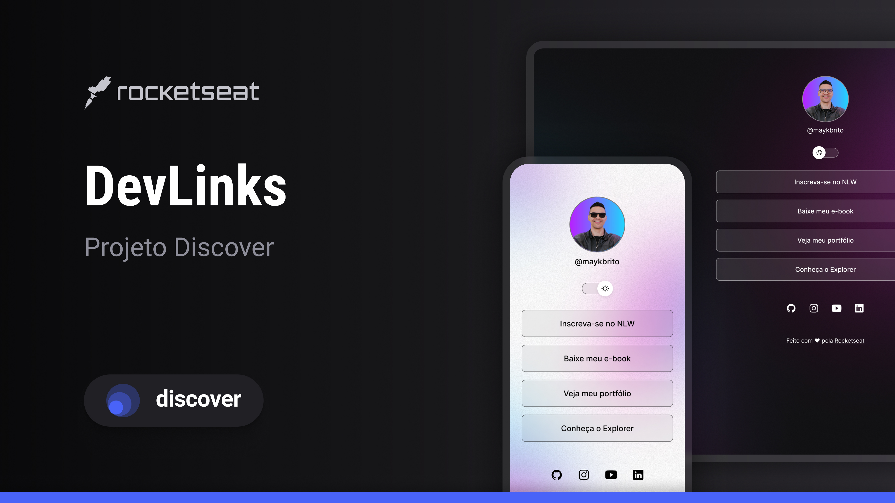

<h1 align="center"> Devlinks </h1>

Programa exclusivo e gratuito, promovido pela Rocketseat para ensino de tecnologias WEB.

<a href="#tecnologias">Tecnologias</a>&nbsp;&nbsp;&nbsp;&nbsp;&nbsp;&nbsp;
<a href="#-projeto">Projeto</a>&nbsp;&nbsp;&nbsp;&nbsp;&nbsp;&nbsp;
<a href="#-layout">Layout</a>&nbsp;&nbsp;&nbsp;&nbsp;&nbsp;&nbsp;
<a href="#mena-licença">Licença</a>

 

  
  

  ## Tecnologias

  Esse projecto foi desenvolvido com as seguintes tecnologias:

  -HTML e CSS
  -JavaScript
  -Git e Github
  -Figma

  ## Projeto

  O DevLinks é um agregador de links para usar como cartão de visitas online.

  ## Layout

  Voce pode visualizar o layout do projeto através [DESSE LINK](https://www.figma.com/file/MF894TdzM99Fg9Ssu4KyMq/DevLinks-(copy)?node-id=1%3A113&t=8x94o7ecTaQMC2CS-1/duplicate). É necessário ter conta no [Figma](https://figma.com)para acessá-lo.

  ## :memo: Licença

  Esse projeto está a licença MIT.

Feito com amor by Rocketseat :wave: [participe da nossa comunidade!](https://discord.gg/rocketseat)
